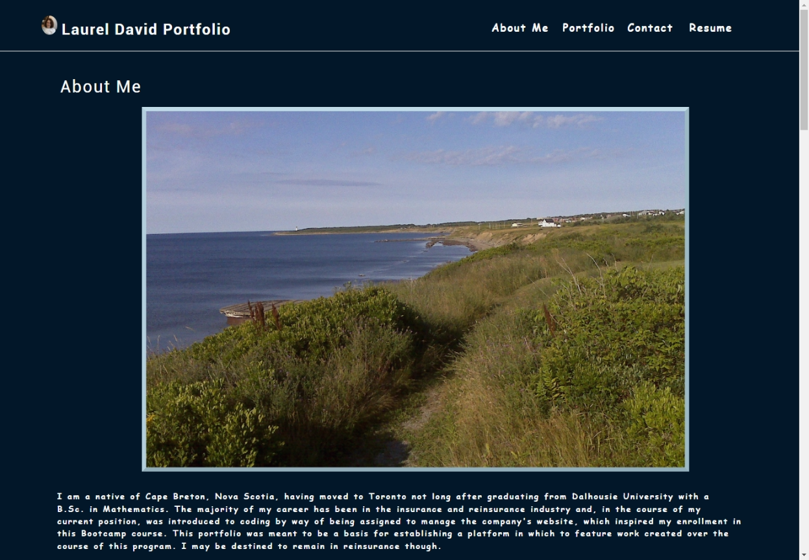
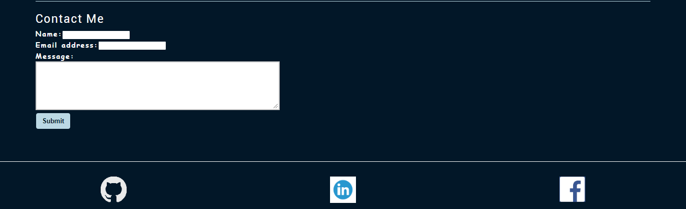

# Title

MY PORTFOLIO REACT APPLICATION

## Description

A Single Page Application (SPA) React portfolio of work samples that may be presented to prospective employers in their assessment of me as a potential candidate for employment.

Output is based on the acceptance criteria outlined in the Module 20 Assignment Overview [Module-20-assignment](https://courses.bootcampspot.com/courses/1181/assignments/23390?module_item_id=466715).

A sample display of expected output is included in the Challenge outline.

## Table of Contents

* [Installation](#installation)
* [Usage](#usage)
* [License](#license)
* [Testing](#testing)
* [Credits](#credits)
* [Questions](#questions)

## Installation

The React App is initiated by running "npm create-react-app"in the CLI and, once the sufficient coding has been added, may be deployed by typing "npm run start" in the CLI.  A webpage is then launched at "localhost:3000".

## Usage

This application enables the user to develop a platform in which that user's web development projects and related works may be presented to prospective employers in their consideration of that user for a potential job position.  The portfolio also features sections in which the user may add personal or other information that may be useful to share with prospective employers when seeking a position.

The main sections of the application are:

* About Me - a short bio about the owner of the portfolio.
  
  .

* Portfolio - Images highlighting the applications featured in the portfolio along with links to their deployed URL (Heroku or GitHub) as well as their respective GitHub links.
  
  .

* Resume - a resume summarizing the portfolio owner's work experience, education, skills and activities which may be useful in the search for employment.  The Resume also includes a link to a PDF version which may be opened and downloaded.

    

* Contact Form that may be used to contact the portfolio owner.  Below that is the Footer which includes links to the portfolio owner's LinkedIn account, GitHub account and facebook/Meta account (although this portfolio owner tries to avoid that last one when possible!).
  
  

## License

This application is covered under the MIT license.  [MIT license link](https://choosealicense.com/licenses/mit/)

## Contributing

Please visit [Contributor Covenant website](https://contributor-covenant.org) for guidance or reach out directly using the contact informtion below.

## Testing

None at this time, although the continuous rendering of React as changes are made to the code does enable the development to measure the impact of each change in the code.

## Credits

Assistance was provided in my weekly tutoring session, one of the Learning Assistants via AskBCS and the usual visits to the Stack Overflow website [https://stackoverflow.com](https://stackoverflow.com).

## Questions?

If you have any questions, please see my contact details below:

## GitHub Username

My GitHub Username is [github.com/lnd4812](https://github.com/lnd4812)

## GitHub Repository

My GitHub repository link for this project is [github.com/lnd4812/mod-20-react-portfolio](https://github.com/lnd4812/mod-20-react-portfolio)

## GitHub Deployment URL

Deployment URL for application is [lnd4812.github.io/mod-20-react-portfoio](https://lnd4812.github.io/mod-20-react-portfolio/).

## Contact information

To contact me directly, please feel free to drop me an e-mail at: <a hef="mailto:laureldavid64@gmail.com">laureldavid64@gmail.com</a>
